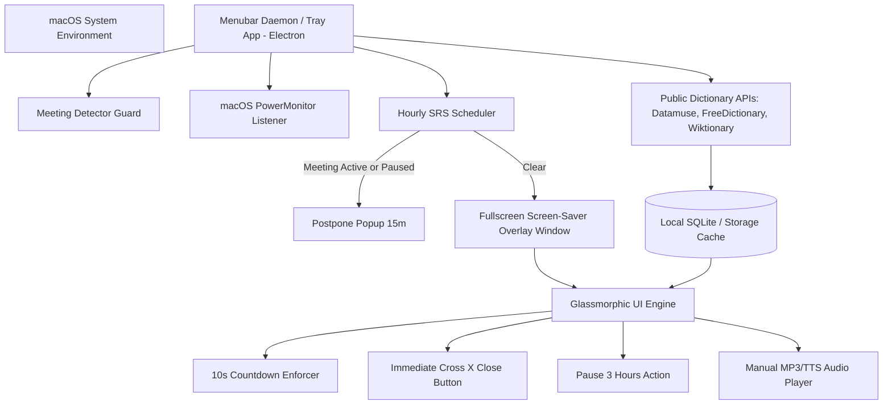

# Implementation Plan: Hourly Forced Vocabulary Immersion App (macOS & Web)

An ultra-focused, full-screen hourly vocabulary learning system designed to boost retention through high-impact full-screen overlays on macOS and Web Browsers.

---

## 1. Executive Summary & Vision

The goal of this application is to turn vocabulary learning into an effort-free, guaranteed daily habit. By presenting **one rich vocabulary card every hour** in a sleek full-screen overlay, users are guided to build fluency over several months.

Key highlights:
- **Zero Mood-Dependence**: Uses a 10-second mandatory viewing countdown on the primary completion button so learning happens consistently.
- **Respects User Workflow**: Features an immediate **Cross (X) Close Button**, automatic **Zoom & Google Meet suppression**, a **"Pause for 3 Hours"** snooze button, and **non-stacking sleep handling**.
- **Dual-Language French & English**: Displays French words with **both French and English definitions**, phonetics, and usage examples with translations.
- **Dynamic Public APIs**: Automatically fetches words, definitions, phonetics, and real audio MP3 pronunciations via public REST APIs (Free Dictionary API, Datamuse, Wiktionary).

---

## 2. Core Feature Matrix

| Feature | Requirement & Behavior |
| :--- | :--- |
| **Hourly Fullscreen Overlay** | Triggers once every hour covering all macOS windows/spaces (`screen-saver` level). |
| **Instant Exit Button** | Top-right **Cross (X)** button available from **0 seconds** for immediate dismissal. |
| **Forced 10s Viewing Lock** | Primary **"I Understand"** button unlocks only after a 10-second circular timer completes. |
| **Meeting Protection Guard** | Suppresses popups if an active **Zoom** process or **Google Meet** browser call is running. |
| **Pause for 3 Hours** | One-click snooze toggle available on popup UI and tray menu. |
| **Manual Audio Playback** | Audio does **not** auto-play; speaker icon plays high-quality MP3 audio on click. |
| **Laptop Sleep Handling** | Laptop lid closed / sleep time does not stack popups; exactly **1 word** shows on wake. |
| **30-Minute Safety Timeout** | If left unattended, overlay automatically closes after 30 minutes. |
| **Dual-Language French** | French word + phonetic + **French Definition** + **English Definition** + **French Example** + **English Translation**. |
| **Mastery & Progression** | Unique word guarantee; **Phase 1 (Week 1)**: New words; **Phase 2 (Week 2+)**: Spaced Repetition (SM-2) revision & 4-option quizzes. |

---

## 3. Architecture & Technical Components



### Technical Stack:
1. **Desktop Daemon (Electron / Node.js)**: Runs in background tray, listens to macOS sleep/wake and active meeting processes.
2. **Public API Integrations**:
   - `api.datamuse.com/words`: Dynamic CEFR-rated vocabulary list generation.
   - `api.dictionaryapi.dev/api/v2/entries/en/<word>`: English definitions, phonetics, audio MP3 URLs, example sentences.
   - `Wiktionary API & Translation endpoints`: French dual-language parsing (French + English meanings).
3. **Local Cache & State Store**: SQLite / IndexedDB for storing word history, seen IDs, and SuperMemo SM-2 repetition schedules.

---

## 4. macOS Enforcement & Attention Strategies

1. **System Window Level Stealing (`screen-saver` level)**:
   - Floating window level set to `kCGScreenSaverWindowLevel` covering all native Mac apps (VSCode, Slack, Finder).
2. **Multi-Space / Multi-Monitor Cover**:
   - `setVisibleOnAllWorkspaces(true)` prevents macOS gesture sliding to another Space.
3. **Background Persistence**:
   - Automatically registered as a macOS `LaunchAgent` (`~/Library/LaunchAgents/com.vocab.immersion.plist`) for auto-launch on boot.

---

## 5. Distribution Strategy & Deployment Roadmap

```
                          Distribution Channels
                                     │
       ┌─────────────────────────────┼─────────────────────────────┐
       ▼                             ▼                             ▼
┌──────────────┐             ┌──────────────┐              ┌──────────────┐
│  macOS App   │             │ Homebrew Cask│              │    Chrome    │
│ (.dmg / .pkg)│             │  & Terminal  │              │  Web Store   │
└──────┬───────┘             └──────┬───────┘              └──────┬───────┘
       │                             │                            │
       ▼                             ▼                            ▼
  Signed/Notarized           `brew install --cask`       Manifest V3 Zip
 (Apple Developer ID)        or 1-line curl script       In-browser Extension
```

1. **macOS Package (.dmg / .pkg)**: Built using `electron-builder` (Universal Binaries for Apple Silicon M1-M4 & Intel). Signed with Apple Developer ID and notarized via `xcrun notarytool`. Integrated auto-updater (`electron-updater`).
2. **Homebrew & Terminal 1-Liner**:
   - `brew install --cask forced-vocab-immersion`
   - `curl -fsSL https://raw.githubusercontent.com/.../install.sh | bash`
3. **Chrome Web Store Channel**: Manifest V3 extension package for users preferring in-browser tab popups.

---

## 6. Clean-up Plan & Uninstallation Steps

Automated 1-click uninstaller script (`uninstall.sh` / `npm run uninstall`):
1. **Stop Daemon**: Kills running menubar daemon process.
2. **Remove Auto-Start**: Deletes `~/Library/LaunchAgents/com.vocab.immersion.plist`.
3. **Wipe Data Directory**: Cleans `~/Library/Application Support/vocab-immersion-app`.
4. **Zero Residue Verification**: Ensures no orphan background tasks or lingering files remain on macOS.

---

## 7. Exhaustive Testing Strategy & QA Plan

To ensure maximum stability, zero crashes, and rock-solid adherence to user experience rules, we implement a **4-Tiered Testing Strategy**:

```
                       ┌─────────────────────────┐
                       │  Tier 4: System & OS    │  (macOS Sleep/Wake, Meeting Guard, Uninstaller)
                       ├─────────────────────────┤
                       │  Tier 3: E2E & Visual   │  (Spectron/Playwright UI & 10s Timer Enforcer)
                       ├─────────────────────────┤
                       │  Tier 2: Integration    │  (IPC Main-Renderer, API Cache, SRS Scheduler)
                       ├─────────────────────────┤
                       │  Tier 1: Unit Tests     │  (Dictionary API Parsers, SM-2 Math Engine)
                       └─────────────────────────┘
```

### Tier 1: Unit Tests (Jest / Vitest)
- **Dictionary API Parser Tests**:
  - Test response parsing for English & French API payloads.
  - Verify dual-language mapping for French entries (validates both French & English definitions exist).
- **Spaced Repetition (SM-2) Math Tests**:
  - Verify interval calculation based on user rating (1 to 5).
  - Test unique word selection logic to guarantee zero duplicates during Phase 1.
- **Meeting Guard Unit Tests**:
  - Test process matcher regex against simulated process outputs (`zoom.us`, `Meeting`, `google-chrome`).

### Tier 2: Integration & IPC Tests
- **IPC Event Communication**:
  - Test main-to-renderer IPC messages (`TRIGGER_POPUP`, `SNOOZE_3H`, `CONFIRM_WORD`, `CLOSE_WINDOW`).
- **3-Hour Pause State Integration**:
  - Verify that invoking "Pause for 3 Hours" sets snooze timestamp correctly and blocks hourly triggers until expiration.
- **Sleep / Wake Event Handler**:
  - Simulate macOS sleep event followed by 4-hour delay; verify system triggers **only 1 popup** upon wake event.

### Tier 3: End-to-End (E2E) & UI Visual Regression Tests (Playwright / Spectron)
- **10-Second Countdown Lock Verification**:
  - Assert that "I Understand" button element has `disabled` state from 0ms to 9,999ms.
  - Assert that at 10,000ms, the button state changes to `enabled`.
- **Immediate Cross (X) Close Button Verification**:
  - Assert that Top-Right Cross (X) close button is clickable at 0ms and immediately closes window.
- **Manual Audio Playback Test**:
  - Verify audio does NOT play on load; assert audio stream initiates only upon clicking speaker icon.
- **30-Minute Safety Timeout Test**:
  - Fast-forward fake timer by 30 minutes; verify window auto-dismisses cleanly.

### Tier 4: macOS System & Environment Verification
- **Multi-Space & Window Level Verification**:
  - Manual test on macOS across 3 spaces; verify overlay displays on top of active Space.
- **Live Meeting Simulation**:
  - Start a test Zoom meeting / Google Meet call; trigger popup manually via CLI; verify popup is deferred until meeting ends.
- **Uninstaller Cleanup Test**:
  - Execute `./uninstall.sh`; verify `ps aux | grep vocab` returns empty and `LaunchAgent` plist is removed.

---

## 8. Proposed Code Architecture

```
/Users/vikasanand/genAI/language-learning/
├── package.json               # Dependencies, build configs, test scripts
├── main.js                    # Main process (timer, tray app, meeting guard, sleep monitor)
├── preload.js                 # Safe IPC renderer bridge
├── install.sh                 # 1-line CLI installer
├── uninstall.sh               # 1-click clean uninstaller script
├── src/
│   ├── index.html             # Full-screen Popup UI HTML
│   ├── styles.css             # Glassmorphic Dark UI & 10s animation ring
│   ├── app.js                 # Front-end UI logic (countdown, audio player, X close, pause 3h)
│   └── engine/
│       ├── dictionaryApi.js   # Live API Integration (FreeDictionary API, Datamuse, Wiktionary)
│       ├── meetingGuard.js    # Zoom & Google Meet active call detector
│       ├── srs.js             # Spaced Repetition (SM-2) engine & Quiz generator
│       └── macEnforcer.js     # Sleep/wake listener & screen-saver level overlay
└── tests/
    ├── unit/
    │   ├── dictionaryApi.test.js
    │   ├── srs.test.js
    │   └── meetingGuard.test.js
    ├── integration/
    │   └── ipc.test.js
    └── e2e/
        └── overlay.spec.js
```

---

## Verification Plan

### Automated Tests
- Run `npm test` executing unit tests for API parsing, SM-2 math, and meeting guard regex.
- Run `npm run test:e2e` executing Playwright/Spectron tests for 10s countdown ring, X close button, and 3h pause action.

### Manual System Verification
1. Launch app via `npm start`.
2. Verify full-screen overlay opens with top-right Cross (X) close button active.
3. Test 10-second countdown lock on "I Understand" button.
4. Test manual audio playback speaker button.
5. Click "Pause for 3 Hours" and check tray menu status.
6. Run `./uninstall.sh` to verify complete residue-free cleanup.
